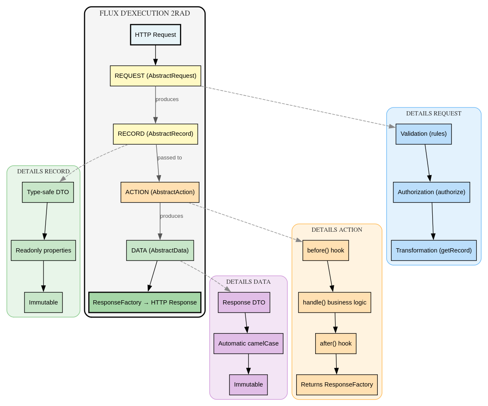

# 2RAD Pattern - Request Record Action Data

## Une architecture pour Laravel basée sur ADR, typée et hautement testable

**Auteur:** Andy Defer
**Version:** 1.0.0
**Date:** 2026-05-31

---

## Table des matières

1. [Introduction](#introduction)
2. [Les problèmes du MVC traditionnel](#les-problèmes-du-mvc-traditionnel)
3. [Le pattern 2RAD](#le-pattern-2rad)
4. [Les quatre piliers](#les-quatre-piliers)
5. [Avantages en termes de testabilité](#avantages-en-termes-de-testabilité)
6. [Comparaison avec d'autres patterns](#comparaison-avec-dautres-patterns)
7. [Guide d'implémentation](#guide-dimplémentation)
8. [Conclusion](#conclusion)

---

## Introduction

Le pattern **2RAD (Request-Record-Action-Data)** est une architecture pour Laravel qui étend le pattern **ADR (Action-Domain-Responder)** avec une couche de typage fort via des **Records** et des **Data DTOs**.

Ce pattern répond aux limitations du MVC traditionnel tout en préservant la simplicité et la rapidité de développement offertes par Laravel.

### Définition rapide

| Composant | Rôle |
|-----------|------|
| **Request** | Validation, autorisation, transformation HTTP → Record |
| **Record** | DTO typé pour le transport des données (Request → Action) |
| **Action** | Logique métier d'une seule route (Template Method) |
| **Data** | DTO immutable pour les réponses HTTP (camelCase) |

---

## Les problèmes du MVC traditionnel

### Problème 1 : Contrôleurs "God Objects"

```php
// Un contrôleur typique avec 7 responsabilités
class UserController extends Controller
{
    public function index() { ... }      // Liste
    public function show($id) { ... }    // Détail
    public function store(Request $r) { ... } // Création
    public function update($id, Request $r) { ... } // Mise à jour
    public function destroy($id) { ... } // Suppression
    public function restore($id) { ... } // Restauration
    public function forceDelete($id) { ... } // Suppression définitive
}
```

**Conséquences :**
- Une classe = une responsabilité (SRP violé)
- Difficile à tester (beaucoup de méthodes à mocker)
- Complexité cognitive élevée

### Problème 2 : Helpers globaux non testables

```php
class UserController extends Controller
{
    public function show($id)
    {
        // Appels à des helpers globaux !
        $user = User::find($id);           // ← Facade/Binding direct
        $this->authorize('view', $user);   // ← Helper global
        Log::info('User viewed');           // ← Facade
        return response()->json($user);    // ← Helper global
    }
}
```

**Conséquences :**
- Tests unitaires impossibles (besoin de Laravel booté)
- Couplage fort au framework
- Effets de bord non maîtrisés

### Problème 3 : Absence de typage entre couches

```php
// Pas de contrat clair entre la Request et le contrôleur
public function store(Request $request)
{
    // $request peut contenir n'importe quoi
    $name = $request->input('name');     // string|null
    $email = $request->input('email');   // string|null
    $age = $request->input('age');       // mixed
}
```

**Conséquences :**
- Erreurs à l'exécution (au lieu de compilation)
- Documentation absente (IDE ne peut pas aider)
- Réfactoring risqué

### Problème 4 : Testabilité médiocre

```php
// Pour tester un contrôleur, il faut :
// 1. Booter Laravel
// 2. Créer des requêtes HTTP
// 3. Vérifier les réponses HTTP
// → Ce sont des tests d'intégration, pas unitaires

public function test_show_user()
{
    $response = $this->getJson('/api/users/1');
    $response->assertStatus(200);
}
```

---

## Le pattern 2RAD

### Vue d'ensemble


### Flux complet

```php
// 1. Route
ActionRoute::get('/api/users/{id}', ShowUserRequest::class, ShowUserAction::class);

// 2. Request valide et transforme les données
final class ShowUserRequest extends AbstractRequest
{
    public function getRecord(): AbstractRecord
    {
        return ShowUserRecord::from([
            'id' => (int) $this->route('id'),
        ]);
    }
}

// 3. Record typé
final class ShowUserRecord extends AbstractRecord
{
    public function __construct(
        public readonly int $id,
    ) {}
}

// 4. Action exécute la logique métier
final class ShowUserAction extends AbstractAction
{
    public function __construct(
        private readonly UserRepository $users,
    ) {}
    
    protected function handle(AbstractRecord $request): ResponseFactory
    {
        $user = $this->users->findOrFail($request->id);
        return ResponseFactory::json(UserData::from($user));
    }
}

// 5. Data DTO pour la réponse
final class UserData extends AbstractData
{
    public function __construct(
        public readonly int $id,
        public readonly string $name,
        public readonly string $email,
    ) {}
}
```

---

## Les quatre piliers

### 1. Request (AbstractRequest)

**Responsabilité unique :** Transformer une requête HTTP en Record typé.

```php
abstract class AbstractRequest extends FormRequest
{
    public function authorize(): bool;
    public function rules(): array;
    abstract public function getRecord(): AbstractRecord;
}
```

**Pourquoi une classe dédiée ?**
- Séparation des préoccupations (validation ≠ logique métier)
- Réutilisable entre plusieurs Actions
- Testable isolément (sans HTTP)

### 2. Record (AbstractRecord)

**Responsabilité unique :** Transporter des données typées entre Request et Action.

```php
abstract class AbstractRecord implements Transformable
{
    use Hydratable;
    public function toArrayWithoutNulls(bool $recursive = true): array;
    public function __toString(): string;
}
```

**Pourquoi un DTO dédié ?**
- Typage fort (les erreurs deviennent des erreurs de compilation)
- Contrat clair entre les couches
- Immutabilité (readonly properties)

### 3. Action (AbstractAction)

**Responsabilité unique :** Exécuter la logique métier d'une seule route.

```php
abstract class AbstractAction
{
    final public function run(AbstractRecord $request): ResponseFactory;
    protected function before(AbstractRecord $request): void;
    abstract protected function handle(AbstractRecord $request): ResponseFactory;
    protected function after(bool $success, ?Exception $e = null, ...): void;
}
```

**Pourquoi une classe par route ?**
- SRP respecté (une seule raison de changer)
- Template Method pour la cohérence
- Hooks `before()` et `after()` pour les opérations transverses

### 4. Data (AbstractData)

**Responsabilité unique :** Structurer les réponses HTTP.

```php
abstract class AbstractData
{
    public function toArray(): array;
    public static function from(array $source): static;
    public static function collect(iterable $items): array;
}
```

**Pourquoi un DTO spécifique pour les réponses ?**
- Sérialisation automatique (camelCase, DateTime, Enums)
- Immutabilité (readonly)
- Séparation entre les données internes (Record) et externes (Data)

---

## Avantages en termes de testabilité

### 1. Tests unitaires des Actions (sans Laravel !)

```php
final class ShowUserActionTest extends TestCase  // ← PHPUnit, pas Orchestra
{
    public function test_returns_user_data_when_user_exists(): void
    {
        // Arrange: Mock du repository (pas de BDD !)
        $user = new User(id: 1, name: 'John');
        $repository = $this->createMock(UserRepository::class);
        $repository->expects($this->once())
            ->method('findOrFail')
            ->with(1)
            ->willReturn($user);
        
        $action = new ShowUserAction($repository);
        $record = ShowUserRecord::from(['id' => 1]);
        
        // Act
        $result = $action->run($record);
        $data = $result->getContent()->toArray();
        
        // Assert: Pas de JSON, pas de HTTP, juste des données
        $this->assertSame('1', $data['id']);
        $this->assertSame('John', $data['name']);
        $this->assertEquals('json', $result->getType()->value);
        $this->assertEquals(200, $result->getStatus());
    }
}
```

**Pourquoi c'est puissant ?**
- ⚡ **Rapide** : 0ms de boot Laravel, 10ms par test
- 🎯 **Précis** : Teste seulement la logique métier
- 🔁 **Isolé** : Pas de base de données, pas de cache, pas de session
- 🛠️ **Maintenable** : Les mocks sont simples et explicites

### 2. Tests unitaires des Requests

```php
final class CreateUserRequestTest extends TestCase
{
    public function test_getRecord_transforms_request_data_correctly(): void
    {
        // Arrange: Créer une requête avec des données
        $request = new CreateUserRequest();
        $request->replace(['name' => 'John', 'email' => 'john@example.com']);
        
        // Act
        $record = $request->getRecord();
        
        // Assert: Le Record est construit correctement
        $this->assertInstanceOf(CreateUserRecord::class, $record);
        $this->assertSame('John', $record->name);
        $this->assertSame('john@example.com', $record->email);
    }
}
```

### 3. Tests des règles de validation (Intégration)

```php
public function test_validation_rules_require_name(): void
{
    $request = new CreateUserRequest();
    $request->replace(['email' => 'john@example.com']);
    
    $validator = Validator::make($request->all(), $request->rules());
    
    $this->assertTrue($validator->fails());
    $this->assertArrayHasKey('name', $validator->errors()->toArray());
}
```

### 4. Tests de la ResponseFactory (sans HTTP)

```php
public function test_json_creates_correct_factory_configuration(): void
{
    $data = UserData::from(['id' => 1, 'name' => 'John']);
    
    $result = ResponseFactory::json($data, 201);
    
    $this->assertEquals('json', $result->getType()->value);
    $this->assertSame($data, $result->getContent());
    $this->assertSame(201, $result->getStatus());
}
```

### Tableau comparatif de testabilité

| Aspect | MVC Classique | 2RAD Pattern |
|--------|---------------|--------------|
| Test unitaire d'un contrôleur | ❌ Impossible (helper globaux) | ✅ Possible (injection de dépendances) |
| Test sans base de données | ⚠️ Complexe (facades à mocker) | ✅ Simple (mock du repository) |
| Test de la validation isolée | ⚠️ Besoin de requête HTTP | ✅ Direct avec les rules() |
| Test du format de réponse | ⚠️ Assertions JSON sur réponse HTTP | ✅ Assertions sur ResponseFactory |
| Temps d'exécution des tests | ~500-1000ms (boot Laravel) | ~10-50ms |
| Mock des dépendances | ❌ Facades statiques | ✅ Injection naturelle |

---

## Comparaison avec d'autres patterns

### ADR (Action-Domain-Responder) classique

```
Request → Action → Responder
```

**Limites d'ADR :**
- Pas de typage fort (les données circulent comme des arrays)
- Pas de DTO dédiés pour les réponses
- Pas de hooks (before/after) standardisés

**Ce qu'apporte 2RAD :**
- `Record` : Type-safe DTO pour les entrées
- `Data` : Type-safe DTO pour les sorties (API)
- `ResponseFactory` : Abstraction des réponses HTTP
- `before()` et `after()` : Cycle de vie standardisé

### MVC Laravel classique

```
Model → View → Controller
```

**Pourquoi 2RAD est meilleur :**
- Une responsabilité par classe (pas de contrôleurs "fourre-tout")
- Pas de helpers globaux (injection de dépendances)
- Typage fort entre les couches
- Testabilité unitaire possible

### Hexagonal Architecture (Ports & Adapters)

```
Port → Adapter → Domain
```

**Points communs :**
- Séparation des préoccupations
- Injection de dépendances
- Testabilité élevée

**Pourquoi 2RAD est plus léger :**
- Intégration native avec Laravel
- Moins de boilerplate
- Framework-aware (pas besoin de recréer les ports HTTP)

---

## Guide d'implémentation

### Structure de dossiers recommandée

```
app/
├── Actions/
│   ├── Api/
│   │   ├── Users/
│   │   │   ├── CreateUserAction.php
│   │   │   ├── ShowUserAction.php
│   │   │   └── DeleteUserAction.php
│   │   └── Products/
│   │       └── ListProductsAction.php
│   └── Web/
│       └── DashboardAction.php
├── Data/
│   ├── UserData.php
│   └── ProductData.php
├── Records/
│   ├── CreateUserRecord.php
│   └── ShowUserRecord.php
└── Http/
    └── Requests/
        ├── Api/
        │   └── Users/
        │       ├── CreateUserRequest.php
        │       └── ShowUserRequest.php
        └── EmptyRequest.php
```

### Bonnes pratiques

#### ✅ À faire

```php
// 1. Typer explicitement le Record dans l'Action
protected function handle(AbstractRecord $request): ResponseFactory
{
    /** @var ShowUserRecord $request */
    $user = $this->users->findOrFail($request->id);
    // ...
}

// 2. Utiliser les hooks pour les opérations transverses
protected function before(AbstractRecord $request): void
{
    $this->logger->info('Starting action', ['record' => $request]);
}

// 3. Injecter les dépendances, pas les helpers
public function __construct(
    private readonly UserRepository $users,
    private readonly LoggerInterface $logger,
) {}
```

#### ❌ À éviter

```php
// 1. Ne pas utiliser de facades dans l'Action
protected function handle(AbstractRecord $request): ResponseFactory
{
    Log::info('...');          // ← À injecter
    Cache::get('...');         // ← À injecter
    DB::table('users')->...;   // ← À injecter
}

// 2. Ne pas typer le Record
protected function handle(AbstractRecord $request): ResponseFactory
{
    $id = $request->id;  // ← Pas de @var, perte du typage
}

// 3. Ne pas faire de logique métier dans la Request
public function getRecord(): AbstractRecord
{
    // ← La validation seulement, pas de logique métier
    if ($this->user()->cannot('create')) { ... }
}
```

### Migration depuis MVC

```bash
# 1. Créer un Record
php artisan make:record ShowUserRecord

# 2. Créer une Request
php artisan make:action-request ShowUserRequest

# 3. Créer une Action
php artisan make:action ShowUserAction

# 4. Créer un Data DTO
php artisan make:data UserData

# 5. Remplacer l'appel du contrôleur par ActionRoute
ActionRoute::get('/api/users/{id}', ShowUserRequest::class, ShowUserAction::class);
```

---

## Conclusion

Le pattern **2RAD (Request-Record-Action-Data)** offre :

### Pour les développeurs
- ✅ **Code auto-documenté** : Les noms des classes disent ce qu'elles font
- ✅ **Type safety** : Les erreurs sont détectées à la compilation
- ✅ **Testabilité maximale** : Tests unitaires rapides et isolés
- ✅ **Injection de dépendances naturelle** : Pas de facades

### Pour les équipes
- ✅ **Standardisation** : Tous les endpoints suivent la même structure
- ✅ **Onboarding facile** : Un pattern à apprendre, pas 10
- ✅ **Code review efficace** : Chaque classe a une responsabilité unique

### Pour l'architecture
- ✅ **Respect de SOLID** : Chaque pilier a sa raison d'être
- ✅ **Framework-aware** : Tire parti de Laravel sans y être couplé
- ✅ **Prêt pour les APIs** : JsonResponse, Inertia, Stream, SSE, Files

### Le résultat

**Avant (MVC) :** Un test d'intégration lent qui vérifie toute la stack

**Après (2RAD) :** 4 tests unitaires rapides qui vérifient chaque couche séparément

```php
// 4 tests, 4 responsabilités, 40ms
RequestTest::test_validation_rules();      // 10ms
RequestTest::test_record_transformation(); // 10ms
ActionTest::test_business_logic();         // 10ms
ResponseTest::test_response_format();      // 10ms
```

**C'est ça, la puissance du pattern 2RAD.**

---

## Références

- [ADR Pattern - Paul M. Jones](https://github.com/pmjones/adr)
- [Template Method Pattern - GoF](https://en.wikipedia.org/wiki/Template_method_pattern)
- [SOLID Principles - Robert C. Martin](https://en.wikipedia.org/wiki/SOLID)
- [Laravel FormRequest Documentation](https://laravel.com/docs/validation#form-request-validation)

---

**Andy Defer** - *Mainteneur du package Laravel Actions*  
📧 [andykanidimbu@gmail.com](mailto:andykanidimbu@gmail.com)  
🐙 [github.com/andydefer](https://github.com/andydefer)