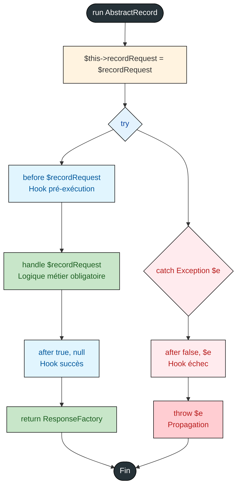

# AbstractAction - Référence Technique

## Description

Classe abstraite de base pour toutes les Actions. Elle implémente le pattern Template Method pour exécuter une logique métier unique par route HTTP.

## Hiérarchie

```
AbstractAction (abstract)
    ├── before() : void
    ├── handle() : ResponseFactory (abstract)
    └── after() : void
```

## Rôle principal

Encapsuler la logique métier d'une **seule route HTTP** dans une classe dédiée. Fournit un cycle de vie cohérent avec des hooks `before()` et `after()` pour les opérations transverses (autorisation, logging, nettoyage).

## Installation

```bash
composer require andydefer/laravel-actions
```

## API / Méthodes publiques

### `run(AbstractRecord $recordRequest = new EmptyRecord): ResponseFactory`

Exécute l'action selon le pattern Template Method.

| Paramètre | Type | Description |
|-----------|------|-------------|
| `$recordRequest` | `AbstractRecord` | Record contenant les données validées de la requête |

**Retourne :** `ResponseFactory` - Factory configurée pour générer la réponse HTTP

**Exceptions :** `Exception` - Toute exception levée dans `handle()` est propagée après l'appel à `after()`

**Exemple :**
```php
$action = new CreateUserAction($userRepository);
$record = CreateUserRecord::from(['name' => 'John', 'email' => 'john@example.com']);
$responseFactory = $action->run($record);
return $responseFactory->toResponse();
```

### `getRecordRequest(): AbstractRecord`

Retourne le Record qui a été passé à l'action.

**Retourne :** `AbstractRecord` - Le Record de la requête

**Exemple :**
```php
$action = new ShowUserAction($userRepository);
$action->run($record);
$sameRecord = $action->getRecordRequest();
```

## Méthodes protégées (à surcharger)

### `before(AbstractRecord $recordRequest): void`

Hook appelé avant `handle()`. À surcharger pour les opérations de pré-traitement.

| Paramètre | Type | Description |
|-----------|------|-------------|
| `$recordRequest` | `AbstractRecord` | Record de la requête |

**Exemple :**
```php
protected function before(AbstractRecord $request): void
{
    if (!$this->authService->isAuthenticated()) {
        throw new UnauthorizedException();
    }
}
```

### `handle(AbstractRecord $recordRequest): ResponseFactory`

Méthode **abstraite** contenant la logique métier principale. Doit être implémentée par toutes les actions concrètes.

| Paramètre | Type | Description |
|-----------|------|-------------|
| `$recordRequest` | `AbstractRecord` | Record contenant les données validées |

**Retourne :** `ResponseFactory` - Factory configurée pour la réponse

**Exemple :**
```php
protected function handle(AbstractRecord $request): ResponseFactory
{
    $user = $this->userRepository->create($request->toArray());
    return ResponseFactory::json(UserData::from($user), 201);
}
```

### `after(bool $success, ?Exception $error = null, AbstractRecord $recordRequest = new EmptyRecord): void`

Hook appelé après `handle()`, qu'il y ait eu succès ou exception.

| Paramètre | Type | Description |
|-----------|------|-------------|
| `$success` | `bool` | `true` si `handle()` a réussi, `false` sinon |
| `$error` | `Exception|null` | L'exception si `$success` vaut `false`, `null` sinon |
| `$recordRequest` | `AbstractRecord` | Record de la requête |

**Exemple :**
```php
protected function after(bool $success, ?Exception $error = null, AbstractRecord $request = new EmptyRecord): void
{
    $this->logger->info('Action executed', ['success' => $success]);
    
    if (!$success && $error) {
        $this->logger->error('Action failed', ['error' => $error->getMessage()]);
    }
}
```

## Cas d'utilisation

### Cas 1 : Action API avec création de ressource

```php
final class CreateUserAction extends AbstractAction
{
    public function __construct(
        private readonly UserRepositoryInterface $userRepository
    ) {}
    
    protected function handle(AbstractRecord $request): ResponseFactory
    {
        $user = $this->userRepository->create($request->toArray());
        
        return ResponseFactory::json(UserData::from($user), 201);
    }
}
```

### Cas 2 : Action avec autorisation et logging

```php
final class DeleteUserAction extends AbstractAction
{
    public function __construct(
        private readonly AuthorizationService $authService,
        private readonly UserRepositoryInterface $userRepository,
        private readonly LoggerInterface $logger
    ) {}
    
    protected function before(AbstractRecord $request): void
    {
        if (!$this->authService->can('delete', $request->userId)) {
            throw new ForbiddenException();
        }
    }
    
    protected function handle(AbstractRecord $request): ResponseFactory
    {
        $this->userRepository->delete($request->userId);
        return ResponseFactory::noContent();
    }
    
    protected function after(bool $success, ?Exception $error = null, AbstractRecord $request = new EmptyRecord): void
    {
        $this->logger->info('User deletion attempted', [
            'user_id' => $request->userId,
            'success' => $success
        ]);
    }
}
```

### Cas 3 : Action Web avec rendu Inertia

```php
final class ShowDashboardAction extends AbstractAction
{
    public function __construct(
        private readonly DashboardService $dashboardService,
        private readonly AuthService $authService
    ) {}
    
    protected function handle(AbstractRecord $request): ResponseFactory
    {
        $stats = $this->dashboardService->getStats();
        $user = $this->authService->getCurrentUser();
        
        return ResponseFactory::inertia('Dashboard/Index', [
            'stats' => $stats,
            'user' => UserData::from($user)
        ]);
    }
}
```

### Cas 4 : Action avec validation métier

```php
final class TransferMoneyAction extends AbstractAction
{
    public function __construct(
        private readonly AccountRepositoryInterface $accountRepository,
        private readonly TransactionService $transactionService
    ) {}
    
    protected function handle(AbstractRecord $request): ResponseFactory
    {
        $sourceAccount = $this->accountRepository->find($request->sourceAccountId);
        $targetAccount = $this->accountRepository->find($request->targetAccountId);
        
        if ($sourceAccount->getBalance() < $request->amount) {
            return ResponseFactory::json([
                'error' => 'Insufficient balance'
            ], 422);
        }
        
        $transaction = $this->transactionService->transfer(
            $sourceAccount,
            $targetAccount,
            $request->amount
        );
        
        return ResponseFactory::json(TransactionData::from($transaction), 201);
    }
}
```

## Flux d'exécution



## Gestion des erreurs

| Situation | Exception | Comportement |
|-----------|-----------|--------------|
| Exception dans `handle()` | `Exception` (ou dérivée) | `after(false, $e)` est appelé, puis l'exception est re-propagée |
| Exception dans `before()` | `Exception` (ou dérivée) | `handle()` n'est PAS exécuté, `after(false, $e)` est appelé |
| Exception dans `after()` (succès) | `Exception` (ou dérivée) | L'exception n'est PAS capturée, se propage normalement |
| Exception dans `after()` (échec) | `Exception` (ou dérivée) | L'exception originale est prioritaire, celle de `after()` est perdue |

## Intégration

`AbstractAction` s'intègre avec :

- **`ResponseFactory`** : Construit les réponses HTTP de manière explicite
- **`AbstractRecord`** : Transporte les données validées de la requête
- **`ActionRoute`** : Enregistre automatiquement les routes associant Request et Action

## Performance

- **Temps d'exécution** : Négligeable (quelques microsecondes par appel)
- **Mémoire** : Une instance par requête (créée via le conteneur Laravel)
- **Aucun cache** : Pas de mécanisme de cache interne

## Compatibilité

| Version | Support |
|---------|---------|
| PHP 8.1+ | ✅ Requis (readonly properties, typed properties) |
| PHP 8.2+ | ✅ Complet |
| PHP 8.3+ | ✅ Complet |
| Laravel 10+ | ✅ Complet |

## Exemple complet

```php
<?php

declare(strict_types=1);

namespace App\Actions\Api\Users;

use AndyDefer\Actions\Actions\AbstractAction;
use AndyDefer\Actions\Http\ResponseFactory;
use AndyDefer\DomainStructures\Abstracts\AbstractRecord;
use App\Data\UserData;
use App\Repositories\UserRepositoryInterface;
use Psr\Log\LoggerInterface;

final class ShowUserAction extends AbstractAction
{
    public function __construct(
        private readonly UserRepositoryInterface $userRepository,
        private readonly LoggerInterface $logger
    ) {}
    
    protected function before(AbstractRecord $request): void
    {
        /** @var ShowUserRecord $request */
        $this->logger->info('Fetching user', ['user_id' => $request->id]);
    }
    
    protected function handle(AbstractRecord $request): ResponseFactory
    {
        /** @var ShowUserRecord $request */
        $user = $this->userRepository->findOrFail($request->id);
        $userData = UserData::from($user->toArray());
        
        return ResponseFactory::json($userData);
    }
    
    protected function after(bool $success, ?Exception $error = null, AbstractRecord $request = new EmptyRecord): void
    {
        /** @var ShowUserRecord $request */
        if ($success) {
            $this->logger->info('User fetched successfully', ['user_id' => $request->id]);
        } else {
            $this->logger->error('Failed to fetch user', [
                'user_id' => $request->id,
                'error' => $error?->getMessage()
            ]);
        }
    }
}
```

## Voir aussi

- `ResponseFactory` - Construction de réponses HTTP explicites
- `AbstractRequest` - Validation et transformation HTTP → Record
- `ActionRoute` - Enregistrement automatique des routes

---

# ResponseFactory - Référence Technique

## Description

Factory permettant de construire des réponses HTTP de manière déclarative et testable, sans dépendre directement des helpers globaux de Laravel.

## Hiérarchie

```
ResponseFactory (final)
    └── Génère : JsonResponse | RedirectResponse | StreamedResponse | InertiaResponse | BinaryFileResponse | Response
```

## Rôle principal

Abstraire la création des réponses HTTP derrière une interface fluide et explicite. Permet de tester la configuration d'une réponse sans avoir à exécuter une vraie requête HTTP.

## Installation

```bash
composer require andydefer/laravel-actions
```

## API / Méthodes publiques

### Méthodes statiques de création

#### `json(AbstractData $data, int $code = 200): self`

Crée une réponse JSON pour les API.

| Paramètre | Type | Description |
|-----------|------|-------------|
| `$data` | `AbstractData` | Données à retourner (converties automatiquement en tableau camelCase) |
| `$code` | `int` | Code HTTP (200, 201, 422, etc.) |

**Exemple :**
```php
$response = ResponseFactory::json(UserData::from($user->toArray()), 201);
```

#### `redirect(string $url, int $code = 302): self`

Crée une redirection vers une URL.

| Paramètre | Type | Description |
|-----------|------|-------------|
| `$url` | `string` | URL de destination |
| `$code` | `int` | Code de redirection (301, 302, 303, 307, 308) |

**Exemple :**
```php
$response = ResponseFactory::redirect('/dashboard', 301);
```

#### `redirectRoute(string $route, array $parameters = [], int $code = 302): self`

Crée une redirection vers une route nommée.

| Paramètre | Type | Description |
|-----------|------|-------------|
| `$route` | `string` | Nom de la route |
| `$parameters` | `array` | Paramètres de la route |
| `$code` | `int` | Code de redirection |

**Exemple :**
```php
$response = ResponseFactory::redirectRoute('users.show', ['id' => 123]);
```

#### `redirectBack(int $code = 302): self`

Crée une redirection vers la page précédente.

**Exemple :**
```php
$response = ResponseFactory::redirectBack();
```

#### `noContent(): self`

Crée une réponse 204 No Content.

**Exemple :**
```php
$response = ResponseFactory::noContent();
```

#### `inertia(string $component, array $props = []): self`

Crée une réponse Inertia pour les applications SPA.

| Paramètre | Type | Description |
|-----------|------|-------------|
| `$component` | `string` | Nom du composant React/Vue |
| `$props` | `array` | Propriétés à passer au composant |

**Exemple :**
```php
$response = ResponseFactory::inertia('Dashboard/Index', ['user' => $userData]);
```

#### `html(string $html, int $code = 200): self`

Crée une réponse HTML brute.

**Exemple :**
```php
$response = ResponseFactory::html('<h1>Maintenance</h1>', 503);
```

#### `text(string $content, int $code = 200): self`

Crée une réponse en texte brut.

**Exemple :**
```php
$response = ResponseFactory::text("User ID: {$id}\n", 200);
```

#### `view(string $view, array $data = [], int $code = 200): self`

Crée une réponse basée sur une vue Blade.

**Exemple :**
```php
$response = ResponseFactory::view('emails.welcome', ['user' => $userData]);
```

#### `stream(callable $callback, string $contentType = 'application/octet-stream', int $code = 200): self`

Crée une réponse streamée (fichiers volumineux, CSV en temps réel).

**Exemple :**
```php
$callback = function() use ($data) {
    $handle = fopen('php://output', 'w');
    foreach ($data as $row) {
        fputcsv($handle, $row->toArray());
        flush();
    }
    fclose($handle);
};
$response = ResponseFactory::stream($callback, 'text/csv');
```

#### `sse(callable $callback): self`

Crée une réponse Server-Sent Events pour les notifications temps réel.

**Exemple :**
```php
$callback = function() {
    while (true) {
        echo "data: " . json_encode(['time' => time()]) . "\n\n";
        ob_flush();
        flush();
        sleep(1);
    }
};
$response = ResponseFactory::sse($callback);
```

#### `fileInline(string $filePath, ?string $fileName = null): self`

Affiche un fichier directement dans le navigateur (PDF, image, vidéo).

**Exemple :**
```php
$response = ResponseFactory::fileInline(storage_path('invoices/invoice.pdf'), 'facture.pdf');
```

#### `fileDownload(string $filePath, ?string $fileName = null): self`

Force le téléchargement d'un fichier.

**Exemple :**
```php
$response = ResponseFactory::fileDownload(storage_path('exports/users.csv'), 'users.csv');
```

### Méthodes d'instance (fluent)

#### `withHeaders(array $headers): self`

Ajoute des en-têtes HTTP à la réponse.

**Exemple :**
```php
$response = ResponseFactory::json($userData)
    ->withHeaders(['X-RateLimit-Limit' => '100']);
```

#### `withStatus(int $code): self`

Modifie le code HTTP de la réponse.

**Exemple :**
```php
$response = ResponseFactory::json($userData)
    ->withStatus(202);
```

### Méthodes d'inspection

#### `getType(): HttpResponseType`

Retourne le type de réponse (enum).

**Exemple :**
```php
if ($factory->getType() === HttpResponseType::JSON) {
    // Configuration spécifique aux réponses JSON
}
```

#### `getContent(): mixed`

Retourne le contenu brut de la réponse.

#### `getStatus(): int`

Retourne le code HTTP.

#### `getHeaders(): array`

Retourne les en-têtes HTTP.

### Méthode de conversion

#### `toResponse(): mixed`

Convertit la factory en véritable objet réponse HTTP (Laravel/Symfony).

**Exemple :**
```php
$factory = ResponseFactory::json($userData);
return $factory->toResponse();
```

## Cas d'utilisation

### Cas 1 : API REST avec différents codes

```php
// GET /users/1 → 200 OK avec données
$user = $this->userRepository->find(1);
return ResponseFactory::json(UserData::from($user->toArray()));

// POST /users → 201 Created
$user = $this->userRepository->create($request->toArray());
return ResponseFactory::json(UserData::from($user->toArray()), 201);

// DELETE /users/1 → 204 No Content
$this->userRepository->delete(1);
return ResponseFactory::noContent();
```

### Cas 2 : Redirections conditionnelles

```php
if ($request->wantsJson()) {
    return ResponseFactory::json($data);
}
return ResponseFactory::redirectRoute('home');
```

### Cas 3 : Téléchargement de fichier généré

```php
$exporter = new UserExporter();
$path = $exporter->generateCsv($this->userRepository->findAll());

return ResponseFactory::fileDownload($path, "users-{$date}.csv");
```

## Flux d'exécution

```
ResponseFactory::json($data, 201)
    │
    ├── new self(JSON, $data)
    ├── $instance->status = 201
    └── return $instance
         │
         ↓
$instance->withHeaders(['X-Custom' => 'value'])
         │
         ↓
$instance->toResponse()
         │
         └── match($type)
              └── JSON → toJsonResponse()
                   └── response()->json($data->toArray(), 201, $headers)
```

## Gestion des erreurs

| Situation | Comportement |
|-----------|--------------|
| Fichier inexistant pour `fileInline()` | Exception Symfony (File not found) |
| Route inexistante pour `redirectRoute()` | Exception Laravel (Route not found) |
| Vue inexistante pour `view()` | Exception Laravel (View not found) |
| Données invalides dans `AbstractData` | Exception à la conversion `toArray()` |

## Intégration

`ResponseFactory` s'intègre avec :

- **`AbstractData`** : Convertit automatiquement les DTO en tableau camelCase
- **Laravel Helpers** : `response()->json()`, `redirect()`, `back()`, `response()->view()`
- **Inertia** : `Inertia::render()`
- **Symfony** : `BinaryFileResponse`, `StreamedResponse`

## Performance

- **Aucune surcharge** : Simple wrapper autour des helpers natifs de Laravel
- **Construction paresseuse** : La vraie réponse n'est créée qu'à l'appel de `toResponse()`
- **Réutilisable** : Une même factory peut être modifiée avant conversion

## Compatibilité

| Version | Support |
|---------|---------|
| Laravel 10.x | ✅ Complet |
| Laravel 11.x | ✅ Complet |
| Laravel 12.x | ✅ Complet |
| PHP 8.1+ | ✅ Requis |

## Exemple complet

```php
<?php

declare(strict_types=1);

namespace App\Actions\Api\Users;

use AndyDefer\Actions\Actions\AbstractAction;
use AndyDefer\Actions\Http\ResponseFactory;
use AndyDefer\DomainStructures\Abstracts\AbstractRecord;
use App\Data\UserData;
use App\Repositories\UserRepositoryInterface;

final class ShowUserAction extends AbstractAction
{
    public function __construct(
        private readonly UserRepositoryInterface $userRepository
    ) {}
    
    protected function handle(AbstractRecord $request): ResponseFactory
    {
        /** @var ShowUserRecord $request */
        $user = $this->userRepository->findOrFail($request->id);
        
        return ResponseFactory::json(UserData::from($user->toArray()))
            ->withHeaders(['X-Cache' => 'miss'])
            ->withStatus(200);
    }
}

// Enregistrement de la route
ActionRoute::get('/api/users/{id}', ShowUserRequest::class, ShowUserAction::class);
```
---