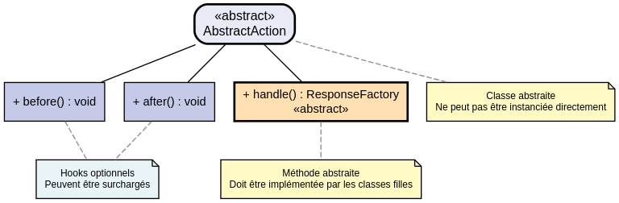
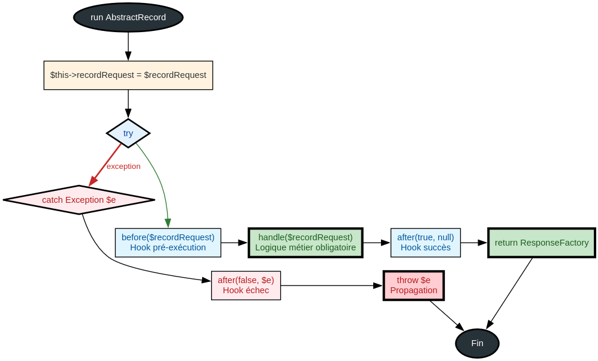

# AbstractAction - Référence Technique

## Description

Classe abstraite de base pour toutes les Actions. Elle implémente le pattern Template Method pour exécuter une logique métier unique par route HTTP.

## Hiérarchie



## Rôle principal

Encapsuler la logique métier d'une **seule route HTTP** dans une classe dédiée. Fournit un cycle de vie cohérent avec des hooks `before()` et `after()` pour les opérations transverses (autorisation, logging, nettoyage).

## Installation

```bash
composer require andydefer/laravel-actions
```

## API / Méthodes publiques

### `run(AbstractRecord $recordRequest = new EmptyRecord): ResponseFactory`

Exécute l'action selon le pattern Template Method.

| Paramètre | Type | Description |
|-----------|------|-------------|
| `$recordRequest` | `AbstractRecord` | Record contenant les données validées de la requête |

**Retourne :** `ResponseFactory` - Factory configurée pour générer la réponse HTTP

**Exceptions :** `Exception` - Toute exception levée dans `handle()` est propagée après l'appel à `after()`

**Exemple :**
```php
$action = new CreateUserAction($userRepository);
$record = CreateUserRecord::from(['name' => 'John', 'email' => 'john@example.com']);
$responseFactory = $action->run($record);
return $responseFactory->toResponse();
```

### `getRecordRequest(): AbstractRecord`

Retourne le Record qui a été passé à l'action.

**Retourne :** `AbstractRecord` - Le Record de la requête

**Exemple :**
```php
$action = new ShowUserAction($userRepository);
$action->run($record);
$sameRecord = $action->getRecordRequest();
```

## Méthodes protégées (à surcharger)

### `before(AbstractRecord $recordRequest): void`

Hook appelé avant `handle()`. À surcharger pour les opérations de pré-traitement.

| Paramètre | Type | Description |
|-----------|------|-------------|
| `$recordRequest` | `AbstractRecord` | Record de la requête |

**Exemple :**
```php
protected function before(AbstractRecord $request): void
{
    if (!$this->authService->isAuthenticated()) {
        throw new UnauthorizedException();
    }
}
```

### `handle(AbstractRecord $recordRequest): ResponseFactory`

Méthode **abstraite** contenant la logique métier principale. Doit être implémentée par toutes les actions concrètes.

| Paramètre | Type | Description |
|-----------|------|-------------|
| `$recordRequest` | `AbstractRecord` | Record contenant les données validées |

**Retourne :** `ResponseFactory` - Factory configurée pour la réponse

**Exemple :**
```php
protected function handle(AbstractRecord $request): ResponseFactory
{
    $user = $this->userRepository->create($request->toArray());
    return ResponseFactory::json(UserData::from($user), 201);
}
```

### `after(bool $success, ?Exception $error = null, AbstractRecord $recordRequest = new EmptyRecord): void`

Hook appelé après `handle()`, qu'il y ait eu succès ou exception.

| Paramètre | Type | Description |
|-----------|------|-------------|
| `$success` | `bool` | `true` si `handle()` a réussi, `false` sinon |
| `$error` | `Exception|null` | L'exception si `$success` vaut `false`, `null` sinon |
| `$recordRequest` | `AbstractRecord` | Record de la requête |

**Exemple :**
```php
protected function after(bool $success, ?Exception $error = null, AbstractRecord $request = new EmptyRecord): void
{
    $this->logger->info('Action executed', ['success' => $success]);
    
    if (!$success && $error) {
        $this->logger->error('Action failed', ['error' => $error->getMessage()]);
    }
}
```

## Cas d'utilisation

### Cas 1 : Action API avec création de ressource

```php
final class CreateUserAction extends AbstractAction
{
    public function __construct(
        private readonly UserRepositoryInterface $userRepository
    ) {}
    
    protected function handle(AbstractRecord $request): ResponseFactory
    {
        $user = $this->userRepository->create($request->toArray());
        
        return ResponseFactory::json(UserData::from($user), 201);
    }
}
```

### Cas 2 : Action avec autorisation et logging

```php
final class DeleteUserAction extends AbstractAction
{
    public function __construct(
        private readonly AuthorizationService $authService,
        private readonly UserRepositoryInterface $userRepository,
        private readonly LoggerInterface $logger
    ) {}
    
    protected function before(AbstractRecord $request): void
    {
        if (!$this->authService->can('delete', $request->userId)) {
            throw new ForbiddenException();
        }
    }
    
    protected function handle(AbstractRecord $request): ResponseFactory
    {
        $this->userRepository->delete($request->userId);
        return ResponseFactory::noContent();
    }
    
    protected function after(bool $success, ?Exception $error = null, AbstractRecord $request = new EmptyRecord): void
    {
        $this->logger->info('User deletion attempted', [
            'user_id' => $request->userId,
            'success' => $success
        ]);
    }
}
```

### Cas 3 : Action Web avec rendu Inertia

```php
final class ShowDashboardAction extends AbstractAction
{
    public function __construct(
        private readonly DashboardService $dashboardService,
        private readonly AuthService $authService
    ) {}
    
    protected function handle(AbstractRecord $request): ResponseFactory
    {
        $stats = $this->dashboardService->getStats();
        $user = $this->authService->getCurrentUser();
        
        return ResponseFactory::inertia('Dashboard/Index', [
            'stats' => $stats,
            'user' => UserData::from($user)
        ]);
    }
}
```

### Cas 4 : Action avec validation métier

```php
final class TransferMoneyAction extends AbstractAction
{
    public function __construct(
        private readonly AccountRepositoryInterface $accountRepository,
        private readonly TransactionService $transactionService
    ) {}
    
    protected function handle(AbstractRecord $request): ResponseFactory
    {
        $sourceAccount = $this->accountRepository->find($request->sourceAccountId);
        $targetAccount = $this->accountRepository->find($request->targetAccountId);
        
        if ($sourceAccount->getBalance() < $request->amount) {
            return ResponseFactory::json([
                'error' => 'Insufficient balance'
            ], 422);
        }
        
        $transaction = $this->transactionService->transfer(
            $sourceAccount,
            $targetAccount,
            $request->amount
        );
        
        return ResponseFactory::json(TransactionData::from($transaction), 201);
    }
}
```

## Flux d'exécution





## Gestion des erreurs

| Situation | Exception | Comportement |
|-----------|-----------|--------------|
| Exception dans `handle()` | `Exception` (ou dérivée) | `after(false, $e)` est appelé, puis l'exception est re-propagée |
| Exception dans `before()` | `Exception` (ou dérivée) | `handle()` n'est PAS exécuté, `after(false, $e)` est appelé |
| Exception dans `after()` (succès) | `Exception` (ou dérivée) | L'exception n'est PAS capturée, se propage normalement |
| Exception dans `after()` (échec) | `Exception` (ou dérivée) | L'exception originale est prioritaire, celle de `after()` est perdue |

## Intégration

`AbstractAction` s'intègre avec :

- **`ResponseFactory`** : Construit les réponses HTTP de manière explicite
- **`AbstractRecord`** : Transporte les données validées de la requête
- **`ActionRoute`** : Enregistre automatiquement les routes associant Request et Action

## Performance

- **Temps d'exécution** : Négligeable (quelques microsecondes par appel)
- **Mémoire** : Une instance par requête (créée via le conteneur Laravel)
- **Aucun cache** : Pas de mécanisme de cache interne

## Compatibilité

| Version | Support |
|---------|---------|
| PHP 8.1+ | ✅ Requis (readonly properties, typed properties) |
| PHP 8.2+ | ✅ Complet |
| PHP 8.3+ | ✅ Complet |
| Laravel 10+ | ✅ Complet |

## Exemple complet

```php
<?php

declare(strict_types=1);

namespace App\Actions\Api\Users;

use AndyDefer\Actions\Actions\AbstractAction;
use AndyDefer\Actions\Http\ResponseFactory;
use AndyDefer\DomainStructures\Abstracts\AbstractRecord;
use App\Data\UserData;
use App\Repositories\UserRepositoryInterface;
use Psr\Log\LoggerInterface;

final class ShowUserAction extends AbstractAction
{
    public function __construct(
        private readonly UserRepositoryInterface $userRepository,
        private readonly LoggerInterface $logger
    ) {}
    
    protected function before(AbstractRecord $request): void
    {
        /** @var ShowUserRecord $request */
        $this->logger->info('Fetching user', ['user_id' => $request->id]);
    }
    
    protected function handle(AbstractRecord $request): ResponseFactory
    {
        /** @var ShowUserRecord $request */
        $user = $this->userRepository->findOrFail($request->id);
        $userData = UserData::from($user->toArray());
        
        return ResponseFactory::json($userData);
    }
    
    protected function after(bool $success, ?Exception $error = null, AbstractRecord $request = new EmptyRecord): void
    {
        /** @var ShowUserRecord $request */
        if ($success) {
            $this->logger->info('User fetched successfully', ['user_id' => $request->id]);
        } else {
            $this->logger->error('Failed to fetch user', [
                'user_id' => $request->id,
                'error' => $error?->getMessage()
            ]);
        }
    }
}
```

## Voir aussi

- `ResponseFactory` - Construction de réponses HTTP explicites
- `AbstractRequest` - Validation et transformation HTTP → Record
- `ActionRoute` - Enregistrement automatique des routes

---
