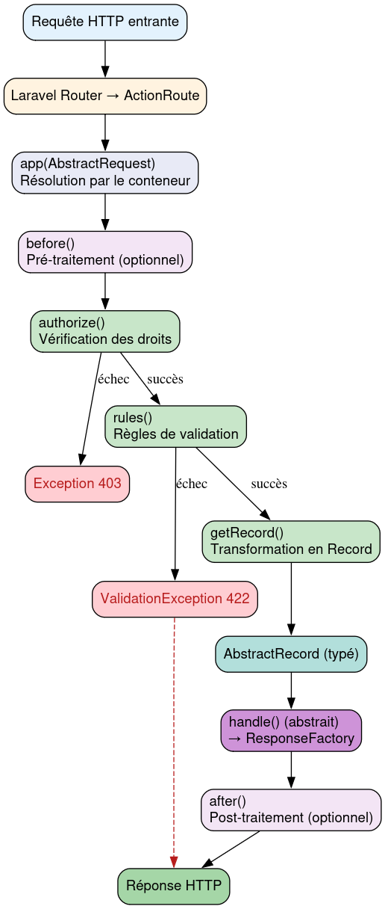

# AbstractRequest - Référence Technique

## Description

Classe abstraite de base pour toutes les requêtes HTTP dans le système d'Action. Étend `FormRequest` de Laravel pour fournir validation et autorisation.

## Hiérarchie

```
Illuminate\Foundation\Http\FormRequest
    └── AbstractRequest (abstract)
```

## Rôle principal

Faire le pont entre la requête HTTP entrante et l'Action. Valide les données, autorise l'utilisateur, puis transforme les données validées en un objet `AbstractRecord` typé qui sera passé à l'Action.

## Installation

```bash
composer require andydefer/laravel-actions
```

## API / Méthodes publiques

### `authorize(): bool`

Détermine si l'utilisateur est autorisé à effectuer cette requête.

| Paramètre | Type | Description |
|-----------|------|-------------|
| Aucun | - | - |

**Retourne :** `bool` - `true` si l'utilisateur est autorisé, `false` sinon

**Exemple :**
```php
public function authorize(): bool
{
    return $this->user()->can('create', Post::class);
}
```

### `rules(): array`

Définit les règles de validation applicables à la requête.

**Retourne :** `array<string, array<int, string>>` - Tableau associatif champ → règles

**Exemple :**
```php
public function rules(): array
{
    return [
        'email' => ['required', 'email', 'unique:users'],
        'name' => ['required', 'string', 'max:255'],
    ];
}
```

### `getRecord(): AbstractRecord`

Transforme la requête HTTP validée en un objet Record typé.

**Retourne :** `AbstractRecord` - Record contenant toutes les données de la requête

**Exceptions :** Aucune (mais la validation Laravel peut lever `ValidationException`)

**Exemple :**
```php
public function getRecord(): AbstractRecord
{
    return CreateUserRecord::from([
        'name' => $this->input('name'),
        'email' => $this->input('email'),
        'ipAddress' => $this->ip(),
    ]);
}
```

## Cas d'utilisation

### Cas 1 : Requête API avec validation et Record

```php
<?php

declare(strict_types=1);

namespace App\Http\Requests\Api\Users;

use AndyDefer\Actions\Http\Requests\AbstractRequest;
use AndyDefer\DomainStructures\Abstracts\AbstractRecord;
use App\Records\CreateUserRecord;

final class CreateUserRequest extends AbstractRequest
{
    public function authorize(): bool
    {
        return $this->user()->can('create', User::class);
    }

    public function rules(): array
    {
        return [
            'name' => ['required', 'string', 'max:255'],
            'email' => ['required', 'email', 'unique:users'],
            'password' => ['required', 'string', 'min:8'],
        ];
    }

    public function getRecord(): AbstractRecord
    {
        return CreateUserRecord::from([
            'name' => $this->input('name'),
            'email' => $this->input('email'),
            'password' => $this->input('password'),
            'ipAddress' => $this->ip(),
            'userAgent' => $this->userAgent(),
        ]);
    }
}
```

### Cas 2 : Requête avec paramètres d'URL typés

```php
<?php

declare(strict_types=1);

namespace App\Http\Requests\Api\Users;

use AndyDefer\Actions\Http\Requests\AbstractRequest;
use AndyDefer\DomainStructures\Abstracts\AbstractRecord;
use App\Records\ShowUserRecord;

final class ShowUserRequest extends AbstractRequest
{
    public function rules(): array
    {
        return [
            'include' => ['string', 'in:posts,comments'],
        ];
    }

    public function getRecord(): AbstractRecord
    {
        return ShowUserRecord::from([
            'id' => (int) $this->route('id'),
            'includePosts' => str_contains($this->input('include', ''), 'posts'),
            'includeComments' => str_contains($this->input('include', ''), 'comments'),
        ]);
    }
}
```

### Cas 3 : Requête web avec données de session

```php
<?php

declare(strict_types=1);

namespace App\Http\Requests\Web\Dashboard;

use AndyDefer\Actions\Http\Requests\AbstractRequest;
use AndyDefer\DomainStructures\Abstracts\AbstractRecord;
use App\Records\DashboardRecord;

final class DashboardRequest extends AbstractRequest
{
    public function authorize(): bool
    {
        return $this->user() !== null;
    }

    public function rules(): array
    {
        return [
            'period' => ['string', 'in:day,week,month'],
        ];
    }

    public function getRecord(): AbstractRecord
    {
        return DashboardRecord::from([
            'userId' => $this->user()->id,
            'period' => $this->input('period', 'day'),
            'preferences' => session()->get('dashboard_preferences', []),
        ]);
    }
}
```

## Flux d'exécution



## Gestion des erreurs

| Situation | Exception | Message |
|-----------|-----------|---------|
| Autorisation refusée | `Symfony\Component\HttpKernel\Exception\HttpException` | `This action is unauthorized.` (403) |
| Validation échouée | `Illuminate\Validation\ValidationException` | Messages d'erreur formatés selon les règles |
| Route parameter manquant | `Symfony\Component\HttpKernel\Exception\NotFoundHttpException` | (404) selon la route |
| Méthode `getRecord()` non implémentée | `Error` | `Class X contains 1 abstract method and must therefore be declared abstract` |

## Intégration

`AbstractRequest` s'intègre avec :

- **Laravel FormRequest** : Hérite de toutes les fonctionnalités de validation
- **ActionRoute** : Enregistre automatiquement la route avec la Request et l'Action
- **AbstractRecord** : Produit un Record typé pour l'Action
- **Conteneur Laravel** : Résout automatiquement les dépendances du constructeur

## Performance

| Aspect | Caractéristique |
|--------|----------------|
| Validation | Une fois par requête (cachée par Laravel) |
| Autorisation | Une fois par requête |
| Transformation | `O(n)` avec n = nombre de propriétés du Record |
| Mémoire | Une instance par requête (gérée par Laravel) |

## Compatibilité

| Version | Support |
|---------|---------|
| Laravel 10.x | ✅ Complet |
| Laravel 11.x | ✅ Complet |
| Laravel 12.x | ✅ Complet |
| Laravel 13.x | ✅ Complet |
| PHP 8.1+ | ✅ Requis |

## Exemple complet

```php
<?php

declare(strict_types=1);

namespace App\Http\Requests\Api\Users;

use AndyDefer\Actions\Http\Requests\AbstractRequest;
use AndyDefer\DomainStructures\Abstracts\AbstractRecord;
use App\Records\UpdateUserRecord;

final class UpdateUserRequest extends AbstractRequest
{
    public function authorize(): bool
    {
        $userId = (int) $this->route('id');
        
        return $this->user()->can('update', User::findOrFail($userId));
    }

    public function rules(): array
    {
        return [
            'name' => ['sometimes', 'string', 'max:255'],
            'email' => ['sometimes', 'email', 'unique:users,email,' . $this->route('id')],
            'avatar' => ['nullable', 'image', 'max:2048'],
        ];
    }

    public function getRecord(): AbstractRecord
    {
        return UpdateUserRecord::from([
            'id' => (int) $this->route('id'),
            'name' => $this->input('name'),
            'email' => $this->input('email'),
            'hasAvatar' => $this->hasFile('avatar'),
            'avatar' => $this->file('avatar'),
            'updatedBy' => $this->user()->id,
        ]);
    }
}

// Enregistrement dans routes/web.php
ActionRoute::put('/api/users/{id}', UpdateUserRequest::class, UpdateUserAction::class);
```
---