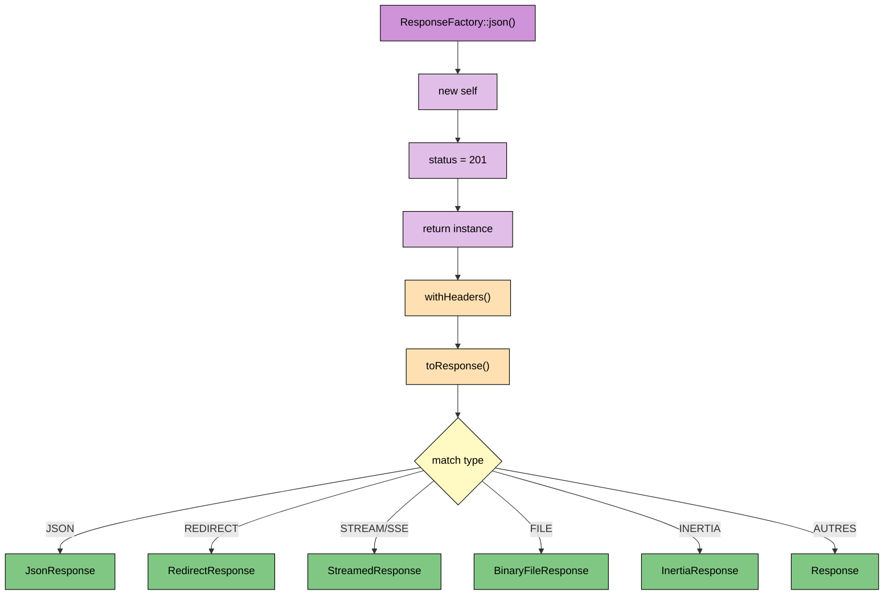

# ResponseFactory - Référence Technique

## Description

Factory permettant de construire des réponses HTTP de manière déclarative et testable, sans dépendre directement des helpers globaux de Laravel.

## Hiérarchie

```
ResponseFactory (final)
    └── Génère : JsonResponse | RedirectResponse | StreamedResponse | InertiaResponse | BinaryFileResponse | Response
```

## Rôle principal

Abstraire la création des réponses HTTP derrière une interface fluide et explicite. Permet de tester la configuration d'une réponse sans avoir à exécuter une vraie requête HTTP.

## Installation

```bash
composer require andydefer/laravel-actions
```

## API / Méthodes publiques

### Méthodes statiques de création

#### `json(AbstractData $data, int $code = 200): self`

Crée une réponse JSON pour les API.

| Paramètre | Type | Description |
|-----------|------|-------------|
| `$data` | `AbstractData` | Données à retourner (converties automatiquement en tableau camelCase) |
| `$code` | `int` | Code HTTP (200, 201, 422, etc.) |

**Retourne :** `self` - Instance configurée pour une réponse JSON

**Exemple :**
```php
$user = $this->userRepository->find(1);
return ResponseFactory::json(UserData::from($user->toArray()), 200);
```

#### `redirect(string $url, int $code = 302): self`

Crée une redirection vers une URL absolue.

| Paramètre | Type | Description |
|-----------|------|-------------|
| `$url` | `string` | URL de destination |
| `$code` | `int` | Code de redirection (301, 302, 303, 307, 308) |

**Exemple :**
```php
return ResponseFactory::redirect('/dashboard', 301);
```

#### `redirectRoute(string $route, array $parameters = [], int $code = 302): self`

Crée une redirection vers une route nommée.

| Paramètre | Type | Description |
|-----------|------|-------------|
| `$route` | `string` | Nom de la route |
| `$parameters` | `array` | Paramètres de la route (ex: `['id' => 123]`) |
| `$code` | `int` | Code de redirection |

**Exemple :**
```php
return ResponseFactory::redirectRoute('users.show', ['id' => 123]);
```

#### `redirectBack(int $code = 302): self`

Crée une redirection vers la page précédente.

**Exemple :**
```php
return ResponseFactory::redirectBack();
```

#### `noContent(): self`

Crée une réponse 204 No Content (succès sans contenu).

**Exemple :**
```php
$this->userRepository->delete($id);
return ResponseFactory::noContent();
```

#### `inertia(string $component, array $props = []): self`

Crée une réponse Inertia pour les applications SPA (React/Vue).

| Paramètre | Type | Description |
|-----------|------|-------------|
| `$component` | `string` | Nom du composant React/Vue (ex: `Dashboard/Index`) |
| `$props` | `array` | Propriétés à passer au composant |

**Exemple :**
```php
$stats = $this->dashboardService->getStats();
return ResponseFactory::inertia('Dashboard/Index', ['stats' => $stats]);
```

#### `html(string $html, int $code = 200): self`

Crée une réponse HTML brute (pour cas spécifiques : emails, legacy, intégrations).

**Exemple :**
```php
return ResponseFactory::html('<h1>Maintenance</h1>', 503);
```

#### `text(string $content, int $code = 200): self`

Crée une réponse en texte brut.

**Exemple :**
```php
return ResponseFactory::text("User ID: {$id}\n", 200);
```

#### `view(string $view, array $data = [], int $code = 200): self`

Crée une réponse basée sur une vue Blade (pour legacy ou intégrations simples).

**Exemple :**
```php
return ResponseFactory::view('emails.welcome', ['user' => $userData]);
```

#### `stream(callable $callback, string $contentType = 'application/octet-stream', int $code = 200): self`

Crée une réponse streamée pour les fichiers volumineux ou génération en temps réel.

| Paramètre | Type | Description |
|-----------|------|-------------|
| `$callback` | `callable` | Fonction qui écrit dans le flux de sortie |
| `$contentType` | `string` | Type MIME du contenu streamé |
| `$code` | `int` | Code HTTP |

**Exemple :**
```php
$callback = function() use ($exportedData) {
    $handle = fopen('php://output', 'w');
    foreach ($exportedData as $row) {
        fputcsv($handle, $row->toArray());
        flush();
    }
    fclose($handle);
};
return ResponseFactory::stream($callback, 'text/csv');
```

#### `sse(callable $callback): self`

Crée une réponse Server-Sent Events pour les notifications temps réel.

| Paramètre | Type | Description |
|-----------|------|-------------|
| `$callback` | `callable` | Fonction qui émet des événements au format SSE |

**Exemple :**
```php
$callback = function() {
    while (true) {
        echo "data: " . json_encode(['timestamp' => time()]) . "\n\n";
        ob_flush();
        flush();
        sleep(1);
    }
};
return ResponseFactory::sse($callback);
```

#### `fileInline(string $filePath, ?string $fileName = null): self`

Affiche un fichier directement dans le navigateur (PDF, image, vidéo).

| Paramètre | Type | Description |
|-----------|------|-------------|
| `$filePath` | `string` | Chemin absolu ou relatif du fichier |
| `$fileName` | `string|null` | Nom personnalisé (optionnel) |

**Exemple :**
```php
$path = storage_path("invoices/invoice-{$id}.pdf");
return ResponseFactory::fileInline($path, "facture-{$id}.pdf");
```

#### `fileDownload(string $filePath, ?string $fileName = null): self`

Force le téléchargement d'un fichier.

| Paramètre | Type | Description |
|-----------|------|-------------|
| `$filePath` | `string` | Chemin absolu ou relatif du fichier |
| `$fileName` | `string|null` | Nom du fichier téléchargé (optionnel) |

**Exemple :**
```php
$path = storage_path("exports/users.csv");
return ResponseFactory::fileDownload($path, "utilisateurs.csv");
```

### Méthodes d'instance (fluent)

#### `withHeaders(array $headers): self`

Ajoute des en-têtes HTTP à la réponse.

| Paramètre | Type | Description |
|-----------|------|-------------|
| `$headers` | `array<string, string>` | Tableau associatif en-tête → valeur |

**Exemple :**
```php
return ResponseFactory::json($data)
    ->withHeaders(['X-RateLimit-Limit' => '100']);
```

#### `withStatus(int $code): self`

Modifie le code HTTP de la réponse.

**Exemple :**
```php
return ResponseFactory::json($data)
    ->withStatus(202);
```

### Méthodes d'inspection

#### `getType(): HttpResponseType`

Retourne le type de réponse (enum).

**Exemple :**
```php
if ($factory->getType() === HttpResponseType::JSON) {
    // Logique spécifique aux réponses JSON
}
```

#### `getContent(): mixed`

Retourne le contenu brut de la réponse.

**Retourne :** `mixed` - Le contenu (type varie selon le type de réponse)

#### `getStatus(): int`

Retourne le code HTTP.

#### `getHeaders(): array`

Retourne les en-têtes HTTP.

### Méthode de conversion

#### `toResponse(): mixed`

Convertit la factory en véritable objet réponse HTTP (Laravel/Symfony).

**Retourne :** `JsonResponse|RedirectResponse|Response|InertiaResponse|BinaryFileResponse|StreamedResponse`

**Exemple :**
```php
// Dans une route Laravel
Route::get('/api/users/{id}', function (ShowUserRequest $request, ShowUserAction $action) {
    $factory = $action->run($request->getRecord());
    return $factory->toResponse();
});
```

## Cas d'utilisation

### Cas 1 : API REST avec différents codes

```php
// GET /users/1 → 200 OK avec données
$user = $this->userRepository->find(1);
return ResponseFactory::json(UserData::from($user->toArray()));

// POST /users → 201 Created
$user = $this->userRepository->create($request->toArray());
return ResponseFactory::json(UserData::from($user->toArray()), 201);

// DELETE /users/1 → 204 No Content
$this->userRepository->delete(1);
return ResponseFactory::noContent();
```

### Cas 2 : Redirections conditionnelles

```php
if ($request->wantsJson()) {
    return ResponseFactory::json($data);
}
return ResponseFactory::redirectRoute('home');
```

### Cas 3 : Téléchargement de fichier généré

```php
$exporter = new UserExporter();
$path = $exporter->generateCsv($this->userRepository->findAll());

return ResponseFactory::fileDownload($path, "users-{$date}.csv");
```

### Cas 4 : Validation avec retour d'erreur

```php
$errors = $this->validator->validate($request);
if (!empty($errors)) {
    return ResponseFactory::json(['errors' => $errors], 422);
}
```

## Flux d'exécution


## Gestion des erreurs

| Situation | Exception | Message |
|-----------|-----------|---------|
| Fichier inexistant pour `fileInline()` | `Symfony\Component\HttpFoundation\File\Exception\FileNotFoundException` | The file "X" does not exist |
| Fichier inexistant pour `fileDownload()` | `Symfony\Component\HttpFoundation\File\Exception\FileNotFoundException` | The file "X" does not exist |
| Route inexistante pour `redirectRoute()` | `Symfony\Component\Routing\Exception\RouteNotFoundException` | Route [X] not defined |
| Vue inexistante pour `view()` | `InvalidArgumentException` | View [X] not found |
| Données invalides dans `AbstractData` | Exception dépendante de l'implémentation | Variable selon le DTO |

## Intégration

`ResponseFactory` s'intègre avec :

- **`AbstractData`** : Convertit automatiquement les DTO en tableau camelCase via `toArray()`
- **Laravel Helpers** : `response()->json()`, `redirect()`, `back()`, `response()->view()`
- **Inertia** : `Inertia::render()` pour les applications SPA
- **Symfony** : `BinaryFileResponse`, `StreamedResponse` pour les fichiers et streams

## Performance

| Aspect | Caractéristique |
|--------|----------------|
| **Surcharge** | Négligeable (simple wrapper autour des helpers Laravel) |
| **Construction** | Paresseuse (la réponse réelle n'est créée qu'à `toResponse()`) |
| **Réutilisabilité** | Une même instance peut être modifiée avant conversion |
| **Mémoire** | Une instance par Action (créée et jetée rapidement) |

## Compatibilité

| Version | Support |
|---------|---------|
| PHP 8.1+ | ✅ Requis (mixed type, readonly properties) |
| Laravel 10.x | ✅ Complet |
| Laravel 11.x | ✅ Complet |
| Laravel 12.x | ✅ Complet |
| Laravel 13.x | ✅ Complet |

## Exemple complet

```php
<?php

declare(strict_types=1);

namespace App\Actions\Api\Users;

use AndyDefer\Actions\Actions\AbstractAction;
use AndyDefer\Actions\Http\ResponseFactory;
use AndyDefer\DomainStructures\Abstracts\AbstractRecord;
use App\Data\UserData;
use App\Repositories\UserRepositoryInterface;
use Psr\Log\LoggerInterface;

final class ShowUserAction extends AbstractAction
{
    public function __construct(
        private readonly UserRepositoryInterface $userRepository,
        private readonly LoggerInterface $logger
    ) {}
    
    protected function before(AbstractRecord $request): void
    {
        /** @var ShowUserRecord $request */
        $this->logger->info('Fetching user', ['user_id' => $request->id]);
    }
    
    protected function handle(AbstractRecord $request): ResponseFactory
    {
        /** @var ShowUserRecord $request */
        $user = $this->userRepository->findOrFail($request->id);
        $userData = UserData::from($user->toArray());
        
        return ResponseFactory::json($userData)
            ->withHeaders(['X-Cache' => 'miss'])
            ->withStatus(200);
    }
    
    protected function after(bool $success, ?Exception $error = null, AbstractRecord $request = new EmptyRecord): void
    {
        /** @var ShowUserRecord $request */
        if ($success) {
            $this->logger->info('User fetched successfully', ['user_id' => $request->id]);
        } else {
            $this->logger->error('Failed to fetch user', [
                'user_id' => $request->id,
                'error' => $error?->getMessage()
            ]);
        }
    }
}

// Enregistrement de la route
ActionRoute::get('/api/users/{id}', ShowUserRequest::class, ShowUserAction::class);
```
---